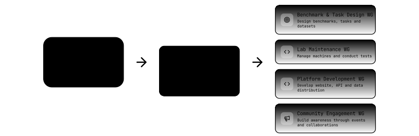
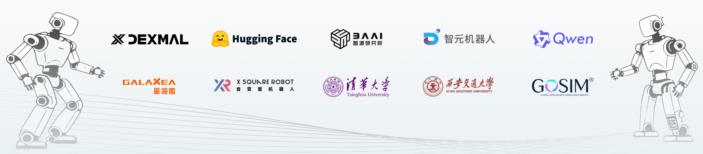

# Community

[中文](./README_zh-CN.md) | **English**

We aim to build a unified, open, and large-scale real-robot-based benchmark platform for embodied intelligence.

**Released: RoboChallenge Annual Report (2025 Q4 – 2026 Q1)**

Based on tens of thousands of real-robot evaluation runs, this report analyzes the Table30 leaderboard performance and reviews representative task cases. It brings together practical insights from participating model teams and volunteers, and compiles recommendations from the RoboChallenge committee and the broader community to inform the platform’s future development.

<p align="center">
  <a href="https://robochallenge.cn/2025%20RoboChallenge%20Annual%20Report.pdf"></a>
</p>

<p align="center">
  Read the Report: <b><a href="https://robochallenge.cn/2025%20RoboChallenge%20Annual%20Report.pdf">English</a> / <a href="https://robochallenge.cn/2025%20RoboChallenge%20%E5%B9%B4%E5%BA%A6%E6%8A%A5%E5%91%8A.pdf">中文版</a></b>
</p>

## How to Join the RC Working Group

Follow these three simple steps to join the RoboChallenge working group and contribute to the future of embodied intelligence.

### Step 1: Read the Governance Model

The **RoboChallenge Committee** is established to ensure that the initiative operates with transparency, fairness, and long-term sustainability, guided by the principles of openness, collaboration, and consensus.

> The organizational structure consists of two key components: the **Steering Committee** and a set of **Working Groups**.



**Read more about our principle and governance model from [here](https://robochallenge.ai/RoboChallenge_Committee_Governance_Model.pdf).**

### Step 2: Find the Working Group

Working Groups (WGs) are the primary execution units of RoboChallenge. Each WG consists of a team of Contributors responsible for a specific aspect of RoboChallenge activities. Each WG has a secretary who is responsible for organizing meetings and supporting the group’s operations.


**Current Working Groups include**:

* **🛠️ Benchmark & Task Design WG**: Responsible for designing and preparing new benchmarks, tasks, and datasets.
* **🤖 Lab Maintenance WG**: Responsible for accepting machine donations, hosting the machines, and conducting the tests.
* **💻 Platform Development WG**: Responsible for developing and maintaining the `robochallenge.ai` website, API services, and data distribution.
* **📢 Community Engagement WG**: Responsible for building awareness through hackathons, academic collaborations, online/offline events and social media.

*Note: Each Working Group (WG) may propose new initiatives, submit proposals for approval, and publish public reports on their progress and outcomes.*

A Working Group is composed of members from partner organizations from the community.


### Step 3: Submit Your Application and Join WG

Interested organizations and companies may send your proposal by email.

Please copy the template below and send it to **[partnership@robochallenge.ai](mailto:partnership@robochallenge.ai)**.

```text
Subject: RoboChallenge Working Group Application - [Your Organization Name]

Dear RoboChallenge Committee,

I am writing to apply to join the RoboChallenge Working Group Community. My information is provided below:

Organization Name *:
[Your Company/Organization]

Email Address *:
[Your Email]

Organization Introduction *:
[Briefly describe your organization and how your work relates to embodied intelligence.]

Working Groups to Join *:
[Select one or more: Benchmark & Task Design / Lab Maintenance / Platform Development / Community Engagement]

Proposed Contribution *:
[Describe the resources you can bring and how you plan to collaborate with other partners.]

Goals on the RoboChallenge:
[Explain what you hope to achieve through RoboChallenge and your long-term vision.]

Recommendation from Existing Partners:
[Name + Organization + A brief recommendation statement from an existing partner.]

Organization Logo *:
[Please attach your organization’s logo to this email.]

Contact Information *:
[Email, Phone, X (Twitter), WeChat, or other contact details.]

More About Your Organization:
[Website or social media links.]

Best regards,
[Your Name]
```

*> Note: Fields marked with `*` are required.*

## Partners


